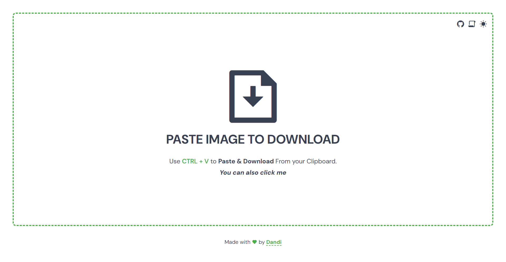
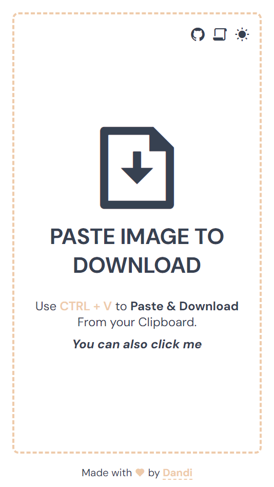

<p align='center'>
  
</p>
<h1 align='center'> PASTE IMAGE TO DOWNLOAD</h1>

## TABLE OF CONTENTS
- [TABLE OF CONTENTS](#table-of-contents)
- [OVERVIEW](#overview)
- [SCREENSHOT](#screenshot)
- [FEATURE](#feature)
- [BUILD WITH](#build-with)
- [AUTHOR](#author)


## OVERVIEW 

This tool is a utility website for downloading image from your clipboard as easy as press ```Ctrl + v``` on your keyboard or just click the box

The pasted images are processed and downloaded locally in your device.
No data is ever sent.

## SCREENSHOT

- Desktop


- Mobile
  <br />


## FEATURE

1. Paste Image by Press ```Ctrl + v``` or Click the box
2. Main Color change every 1.5s
3. Dark/Light Mode Theme Support
4. Responsive Design
5. Open Source Code

## BUILD WITH

1. HTML
2. CSS
3. Javascript / Typescript

## AUTHOR

Github ~ [@msuryaditriputraR](https://github.com/msuryaditriputraR)
